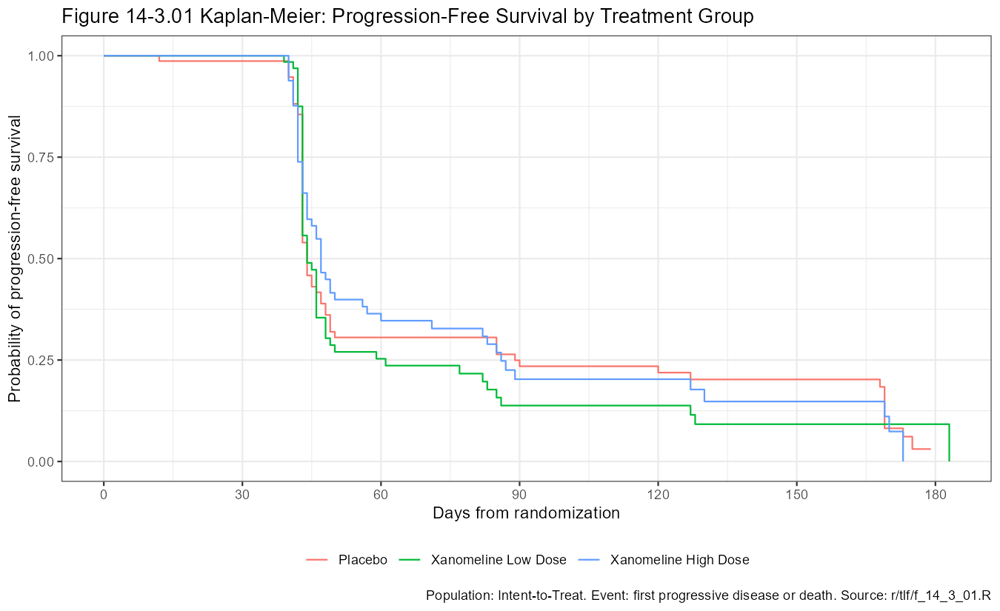

# Oncology Response Data — SDTM Upgrade and ADaM

Dual-programmed (SAS production, R independent QC) upgrade of public oncology SDTM test data to SDTMIG 3.4, then ADaM, with Define-XML 2.1 and Pinnacle 21 validation. ADaM (ADSL, ADRS, ADTTE) follows, with four TLFs.

## Data

[`{pharmaversesdtm}`](https://pharmaverse.github.io/pharmaversesdtm/) 1.5.0 (Apache 2.0): DM, DS, EX, SV and the RECIST 1.1 domains TU, TR, RS.

These are CDISC Pilot subjects (CDISCPILOT01, Alzheimer's disease) with synthetic tumor data added by the pharmaverse team. 254 treated subjects, 52 screen failures. Tumor visits sit on the Pilot visit schedule. This is a programming exercise on test data, not a replication of an oncology study, and not related to any regulatory submission.

Not included: trial design datasets (TA, TE, TV, TI, TS). The tumor data have no protocol of their own, and the only trial design source in the package describes the Alzheimer's study. See COM.TD in the spec.

## Approach

1. Gap analysis of the source against SDTMIG 3.4 and CT 2026-09-25: [docs/SDTM-GAP.md](docs/SDTM-GAP.md)
2. Mapping spec (`specs/sdtm-spec.xlsx`, kept local) drives both programs.
3. SAS programs in `sas/sdtm/`, independent R programs in `r/sdtm/`, compared by key with `{diffdf}`.
4. ADaM from the SDTM above (`sas/adam/`, `r/adam/`): ADSL, ADRS (overall response, progression, best overall response, objective response) and ADTTE (PFS, OS). R uses `{admiral}`.
5. `python/make_define.py` builds Define-XML 2.1 from the spec and the XPT headers.
6. Pinnacle 21 Community, every remaining finding documented.

ADaM notes: Radiologist 1 records (`RSACPTFL = Y`) are analyzed. The source responses are random, so 135 subjects have assessments after a progression (for example PD, then CR); records after the first PD are not used. Best overall response is unconfirmed and SD needs study day 42. Only 3 subjects died, so OS is almost entirely censored. Open issues are listed in the spec (kept local).

Changes to the source include: study day recalculated, EPOCH and `--LOBXFL` added, screen-failure arms set to null, unscheduled visit numbers separated from planned ones, SV `SVPRESP` and `SVOCCUR` added.

## Results

| Layer | Compared | Result |
|---|---|---|
| SDTM | 7 domains (DM, DS, EX, SV, TU, TR, RS) | SAS = R |
| ADaM | 3 datasets (ADSL, ADRS, ADTTE) | SAS = R |
| TLF | 3 tables, 1 figure (cell by cell) | SAS = R |
| Pinnacle 21 SDTM | with define.xml | 0 errors, 951 warnings, 1 reject (no TS) |
| Pinnacle 21 ADaM | with define.xml | 0 errors, 0 warnings |

- Warnings and decisions: [docs/P21-REVIEW.md](docs/P21-REVIEW.md)
- QC findings: [docs/QC-LOG.md](docs/QC-LOG.md)
- Reports: [output/validation/](output/validation/). TLF output: [output/tlf/](output/tlf/)
- define.xml: [define/sdtm/](define/sdtm/), [define/adam/](define/adam/)

## TLF

| Table | Content |
|---|---|
| 14-1.01 | Populations and study disposition |
| 14-2.01 | Best overall response (unconfirmed) and objective response rate |
| 14-3.01 | Progression-free survival: events, median, rates, hazard ratio, log-rank |
| Figure 14-3.01 | Kaplan-Meier, PFS by arm |

Objective response is 19.7% overall (Placebo 20.9%, Low 16.7%, High 21.4%). PFS median is 44, 44 and 47 days; hazard ratios are 1.11 and 0.97 against placebo (log-rank p 0.52 and 0.97). The tumor data are synthetic, so there is no treatment effect to find and these numbers say nothing about the drug.



Figure from the R program; the SAS version is in `output/tlf/sas/`.

## Structure

```
data/source/   XPT exported from pharmaversesdtm (not committed)
data/derived/  SDTM and ADaM datasets from the SAS programs
sas/           production programs: sdtm/, adam/, tlf/
r/             independent QC programs: sdtm/, adam/, tlf/
python/        define.xml builder
define/        Define-XML 2.1
docs/          gap analysis, QC log, P21 review
```

## Source

Data: CDISC Pilot population, pharmaverse (Apache 2.0). Learning and portfolio use only.
